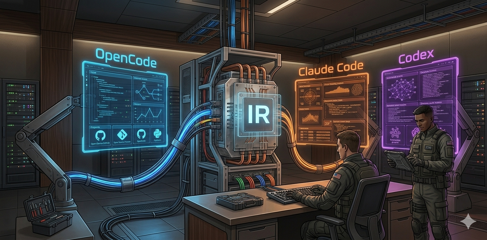

<!-- <CENTERED SECTION FOR GITHUB DISPLAY> -->

<div align="center">

<a href="https://github.com/0xcraft/0xcraft#0xcraft"></a>

[](https://github.com/0xcraft/0xcraft#0xcraft)

[](https://github.com/0xcraft/0xcraft#0xcraft)

</div>

> 0xcraft running Team Mode. One config. Three harnesses. Zero lock-in.

<div align="center">

[](https://github.com/0xcraft/0xcraft/releases)
[](https://www.npmjs.com/package/0xcraft)
[](https://github.com/0xcraft/0xcraft/graphs/contributors)
[](https://github.com/0xcraft/0xcraft/network/members)
[](https://github.com/0xcraft/0xcraft/stargazers)
[](https://github.com/0xcraft/0xcraft/issues)
[](https://github.com/0xcraft/0xcraft/blob/main/LICENSE)

</div>

<!-- </CENTERED SECTION FOR GITHUB DISPLAY> -->

# 0xcraft

You're juggling OpenCode, Claude Code, and Codex. Maintaining 17 agent definitions in three formats. Syncing skills across platforms by hand. Debugging why your Claude plugin works but your Codex TOML doesn't.

We did the work. Built the IR layer. Wrote the matrix. Tested every adapter.

Install 0xcraft. One config. One build command per harness. Done.

## Installation

```bash
npm install -g 0xcraft
# or
bun install 0xcraft
```

See the [Installation Guide](docs/guide/installation.md) for details.

## Highlights

|     | Feature                           | What it does                                                                                                |
| :-: | :-------------------------------- | :---------------------------------------------------------------------------------------------------------- |
| 🔄  | **Converter-First / IR Pipeline** | `import.ts` → IR → `emit.ts`. Symmetric adapters. No cross-adapter imports.                                 |
| 🧩  | **106 × 3 Capability Matrix**     | Single source of truth for feature parity. Asserted on every doctor run.                                    |
| 🎭  | **Multi-Harness Support**         | OpenCode (FS-only), Claude Code (plugin + subagent modes), Codex (TOML + hooks).                            |
| 🪝  | **8 Hook Runtime Primitives**     | `run_command`, `invoke_agent`, `call_mcp_tool`, and more — translated per platform.                         |
| 📦  | **Pack System**                   | Reusable agent packs via npm. `0xcraft-pack.json` manifest + pack-resolver.                                 |
| 🔒  | **Secret Redaction**              | MCP env vars, headers, tokens → `[REDACTED]` before any diagnostic output.                                  |
| 🧪  | **Deterministic Output**          | Same input → byte-identical artifacts. Sorted keys, LF endings, no timestamps.                              |
| ✅  | **571 Tests, 0 Failures**         | Bun test suite. Purity tests enforce layer boundaries. Integration tests cover all 6 conversion directions. |

### Architecture

```
src/core/          ← Harness-agnostic core: agents, skills, hooks, MCP, IR
src/adapters/      ← Per-harness emitters: opencode, claude, codex
src/cli/           ← Commander.js: init, build, convert, import, doctor, pack
```

**Core principle:** Don't over-abstract. Core defines data; adapters map to platform idioms.

---

> **New to 0xcraft?** Read the [Overview](docs/guide/overview.md) to understand what you have, or check the [Converter Guide](docs/guide/converter.md) for how the IR pipeline works.

## CLI Commands

```bash
# Initialize a project
0xcraft init

# Build for a specific harness
0xcraft build --target opencode
0xcraft build --target claude-code --mode claude-plugin
0xcraft build --target codex --force

# Convert between harnesses
0xcraft convert --from opencode --to codex

# Import existing config
0xcraft import --from claude-code --overwrite

# Run diagnostics + capability matrix check
0xcraft doctor --target all --strict

# Manage packs
0xcraft pack add @my-org/agent-pack
0xcraft pack list
```

## Configuration

Create `.0xcraft/config.json` or `.0xcraft/config.jsonc`:

```jsonc
{
  // Disable specific agents
  "disabledAgents": ["go-mentor"],

  // Disable specific skills
  "disabledSkills": ["linkedin-article"],

  // Override models per agent
  "modelOverrides": {
    "team-lead": "opencode/claude-opus-4-7",
    "backend-developer": "github-copilot/gpt-5.5",
  },

  // Add custom MCP servers
  "mcpServers": {
    "my-custom-mcp": {
      "type": "local",
      "command": ["npx", "-y", "my-mcp-server"],
    },
  },

  // Toggle bootstrap hooks
  "agentsGuardEnabled": true,
  "cavemanBootstrapEnabled": true,
  "gitWorktreeBootstrapEnabled": true,
}
```

See [Configuration Documentation](docs/reference/configuration.md) for the full schema.

## Author's Note

I got tired of writing the same agent definitions three times. Once for OpenCode's JSON. Once for Claude's plugin directory. Once for Codex's TOML. Every new skill meant three files. Every bug meant three fixes.

0xcraft is the distillation: one IR layer, three adapters, zero duplication.

**Stop maintaining three configs.**
**Write once. Emit everywhere.**

## License

MIT — free like open source should be.
